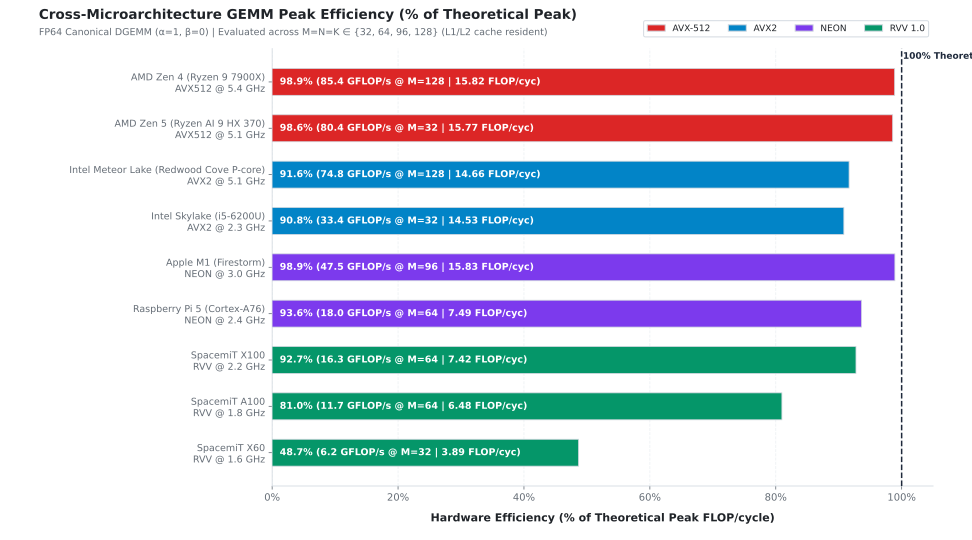
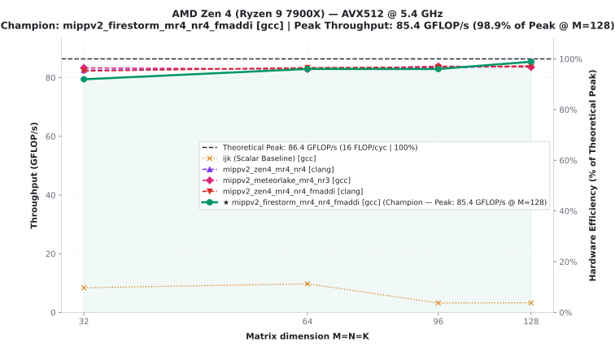
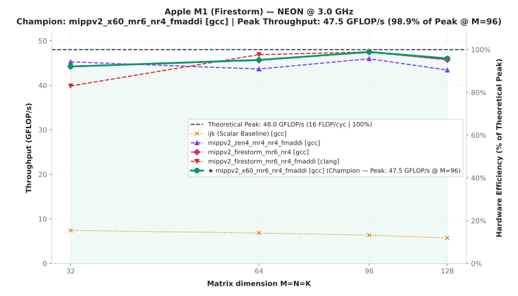
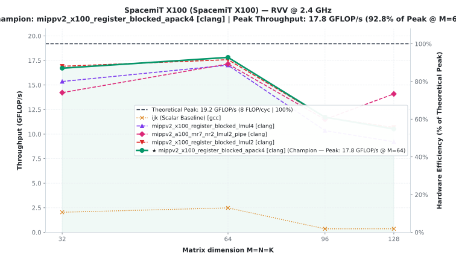

# GEMM Benchmark suite across modern microarchitectures using MIPPv2

> [!WARNING]
> **Work in progress (WIP)**: This repository is under active development. Microkernels, benchmark drivers, and analysis tools are actively worked on. Anything might change 
> at anytime without notice.

A high-performance General Matrix Multiply (DGEMM) microbenchmark and exploration suite built on top of [MIPPv2](https://github.com/aff3ct/MIPP/tree/develop) (MyIntrinsics++ v2).

This suite evaluates DGEMM microkernels written in C++ with MIPPv2 across **9 distinct CPU microarchitectures** :  **x86_64 AVX2 & AVX-512**, **AArch64 NEON**, and **RISC-V Vector** (RVV).

> [!NOTE]
> **Origins & context**: This benchmark was originally written as part of a research internship at **LIP6** (Sorbonne Université), focusing on the design, implementation, and benchmarking of **RISC-V Vector 1.0 (RVV)** support for **MIPPv2** on the **SpacemiT X100** architecture and **AVX2** on the **Intel Skylake** architecture (because it's the one in my laptop).

---

## Microarchitectural Performance & Peak Efficiency

The benchmark evaluates single-thread, compute-bound double-precision GEMM throughput against the hardware theoretical peak ($\text{FLOP/cycle} \times \text{Frequency}$).

> [!IMPORTANT]
> **Benchmark specifications & precision**:
> - **Datatype**: Strictly **IEEE-754 double precision (`double` / FP64)**, *not* single precision (`float` / FP32).
> - **Canonical DGEMM Formulation**: All reported performance metrics evaluate the canonical matrix multiply form $C \leftarrow \alpha (A \times B) + \beta C$ with **$\alpha = 1.0$** and **$\beta = 0.0$** ($C \leftarrow A \times B$).
> - **Non-Canonical Overhead**: Non-canonical configurations ($\beta \neq 0.0$, $\alpha \neq 1.0$) typically incur a performance penalty. Using non-canonical configurations is supported. The performance for it has not yet been evaluated.
> - **Operation Count**: Floating-point throughput is strictly computed as $\text{GFLOP/s} = \frac{2 \times M \times N \times K}{\text{Time (seconds)} \times 10^9}$.

Across all target ISA families (x86_64 AVX2 & AVX-512, ARM NEON, RISC-V Vector), some microkernels achieve **>90% of theoretical peak performance** (reaching up to **>98%** on some uarchs):

| SIMD | Microarchitecture | CPU / SoC Model | Freq (GHz) | Peak FLOP/cyc | Comp | Peak GFLOP/s | DGEMM FLOP/cyc | % of Peak |
| :--- | :--- | :--- | :---: | :---: | :---: | :---: | :---: | :---: |
| **AVX-512** | **AMD Zen 4** | Ryzen 9 7900X | 5.4 | 16.0 | GCC | 85.4 | 15.82 | **98.9 %** |
| **AVX-512** | **AMD Zen 5 Strix Point** | Ryzen AI 9 HX 370 | 5.1 | 16.0 | GCC | 80.4 | 15.77 | **98.6 %** |
| **AVX2** | **Intel Meteor Lake** | Redwood Cove P-Core | 5.1** | 16.0 | GCC | 74.8 | 14.66 | **91.6 %** |
| **AVX2** | **Intel Skylake** | Core i5-6200U | 2.3 | 16.0 | Clang | 33.4 | 14.53 | **90.8 %** |
| **NEON** | **Apple M1 Firestorm** | M1 Ultra (P-core) | 3.0 | 16.0 | GCC | 47.5 | 15.83 | **98.9 %** |
| **NEON** | **Cortex-A76** | Raspberry Pi 5 | 2.4 | 8.0 | GCC | 18.0 | 7.49 | **93.6 %** |
| **RVV 1.0** | **SpacemiT X100** | K3 SoC (VLEN=256) | 2.2* | 8.0 | Clang | 16.3 | 7.42 | **92.7 %** |
| **RVV 1.0** | **SpacemiT A100** | K3 SoC (VLEN=1024) | 1.8* | 8.0 | GCC | 11.7 | 6.48 | **81.0 %** |
| **RVV 1.0** | **SpacemiT X60** | BPI-F3 SoC (VLEN=256)| 1.6 | 8.0 | GCC | 6.2 | 3.89 | **48.7 %** |

> [!NOTE]
> **Roadmap & perspectives: empirical hardware peak measurement**:
> - Currently, all efficiencies are reported against the **theoretical peak** ($\text{FLOP/cycle}$), calculated from the architectural port layout (e.g. $2 \times 4 \times 2 = 16\text{ DP FLOP/cycle}$ for AVX2).
> - **Ongoing work**: Incorporating a benchmark (generalized from `x100_uarch_exp/broadcast_bench.cpp`) directly into the driver suite to measure the empirical hardware FPU ceiling on each target machine and isolate pure FMA pipeline saturation.

> [!IMPORTANT]
> **Cluster clock frequency constraints (SpacemiT X100 & A100)**:
> - **SpacemiT X100**: The SBC is hardware-rated up to **2.4 GHz**. On the LIP6 Dalek cluster node, it is governed at **2.2 GHz** I don't have sudo permissions to modify CPU governors.
> - **SpacemiT A100**: The SBC is hardware-rated up to **2.0 GHz**. On the cluster node, it is governed at **1.8 GHz**.
> 
> All reported GFLOP/s and FLOP/cycle figures are computed against these operating frequencies.

> [!IMPORTANT]
> **Intel Meteor Lake frequency characteristics (burst vs. sustained)**:
> - **5.10 GHz** is the peak single-core turbo frequency of the Redwood Cove P-core.
> - Under sustained heavy compute loads, thermal and power limits typically throttle the core frequency to **~4.70 GHz**.
> - For our reported champion microkernel measurements, we verified via hardware frequency monitoring that the core sustained the full **5.10 GHz** burst clock during the benchmark runs.
> - i.e we made sure that the core is actually running @ 5.1GhZ for the microkernels we expected to perform well. But not for **all** of them. 

> [!NOTE]
> **Zen 5 Strix Point Datapath Note**:
> Server/desktop Zen 5 incorporates dual native 512-bit FMA units ($32\text{ DP FLOP/cycle}$), AMD's mobile Strix Point SoC implements dual 256-bit physical datapaths (*double-pumped* 512-bit FMA, identical to Zen 4), yielding a physical ceiling of **$16\text{ DP FLOP/cycle}$**.
> If you own a Zen5 with 512-bit native FMA units and don't know what to do with it, I'd be very happy if you provided benchmarks results on the existing microkernels :o .

---

## Performance Visualizations

### Cross-Microarchitecture Efficiency (% of Theoretical Peak)



### Representative Architecture Profiles

#### AMD Zen 4 (AVX-512 @ 5.4 GHz) — x86_64


#### Apple M1 Firestorm (NEON @ 3.0 GHz) — AArch64


#### SpacemiT X100 (RVV 256-bit @ 2.2 GHz) — RISC-V


---

## Prerequisites & Building

### 1. Requirements
- **C++20 Compiler**: `g++` (>= 12.0) or `clang++` (>= 15.0).
- **CMake**: version 3.20 or newer.
- **Python**: 3.9+ with `matplotlib`, `pandas`, `numpy`.
- **MIPPv2 Headers**: Obtain the headers from the [MIPP develop branch](https://github.com/aff3ct/MIPP/tree/develop) or download from [MIPP Releases](https://github.com/aff3ct/MIPP/releases).

### 2. Standalone Build
```bash
cmake -B build -S . \
  -DCMAKE_BUILD_TYPE=Release \
  -DMIPPV2_INCLUDE_DIR=/path/to/mipp/include

cmake --build build -j$(nproc)
```

### 3. Build and Run Unit Tests
Unit tests use Catch2 v3 (automatically fetched if not present on system):
```bash
cmake -B build -S . \
  -DCMAKE_BUILD_TYPE=Release \
  -DMIPPV2_INCLUDE_DIR=/path/to/mipp/include \
  -DGEMMBENCH_BUILD_TESTS=ON

cmake --build build -j$(nproc)
ctest --test-dir build --output-on-failure
```

---

## Running Benchmarks

Benchmarks are driven by `./run_benchmarks.sh <platform> [options] [compilers...]`.

Always specify `-o <uarch>_<simd>` to ensure non-colliding, standardized result files:

```bash
# Benchmark Intel Skylake (AVX2) with GCC and Clang
./run_benchmarks.sh avx2 -o skylake_avx2 gcc clang

# Benchmark Intel Meteor Lake (AVX2) on specific matrix sizes
./run_benchmarks.sh avx2 -o meteorlake_avx2 -s 32 -s 64 -s 96 -s 128 gcc clang

# Benchmark AMD Zen 4 (AVX-512) pinned to core 0
./run_benchmarks.sh avx512 -o zen4_avx512 -c 0 gcc clang

# Benchmark SpacemiT X100 with clean rebuild
./run_benchmarks.sh rvv_x100 -o x100_rvv --rebuild clang
```

---

## Plotting & Performance Analysis

The analytical suite [`plot_results.py`](file:///home/ivan/Files/projets/gemm_bench/plot_results.py) reads the hierarchical hardware specification in [`uarch_config.json`](file:///home/ivan/Files/projets/gemm_bench/uarch_config.json), scans the benchmark datasets, identifies the champion kernel for each microarchitecture, and outputs comparison plots:

```bash
# Generate all plots from reference datasets
python3 plot_results.py --input-dir gemm-bench-results --output plots

# Filter specific architectures or SIMD extensions
python3 plot_results.py --input-dir gemm-bench-results --uarch zen4 zen5 m1
python3 plot_results.py --input-dir gemm-bench-results --simd avx512 neon

# Override clock frequencies (in GHz) for dynamic boost clock analysis
python3 plot_results.py --input-dir gemm-bench-results --freq zen4=5.4,m1=3.0
```

### Output Figures (`plots/`)
- `cross_uarch_efficiency_comparison.svg`: Multi-architecture comparison in **% of theoretical peak**.
- `cross_uarch_flop_cycle_comparison.svg`: Multi-architecture comparison in **DP FLOP/cycle**.
- `<simd>_<uarch>_overview.svg`: Per-architecture detailed breakdown showing top kernels, scalar baseline, and dual-axis throughput (GFLOP/s and FLOP/cycle).

---

## Developer Tutorial: Adding a New Microkernel

This end-to-end tutorial demonstrates how to implement, register, test, benchmark, and analyze a new GEMM microkernel across the entire pipeline.

### Step 1: Implement the Kernel in C++
Microkernels are implemented in [`include/GemmUKernel_opti.hpp`](file:///home/ivan/Files/projets/gemm_bench/include/GemmUKernel_opti.hpp) (or [`include/GemmUKernel_explo.hpp`](file:///home/ivan/Files/projets/gemm_bench/include/GemmUKernel_explo.hpp) for exploratory variants).

1. **Choose Register Tile Geometry ($M_R \times N_R$)**:
   - In elements: $M_R$ rows $\times$ $N_R$ columns, where $N_R = N_V \times VL$ ($N_V$ vectors wide, $VL = \text{vlen}$).
   - Accumulator vector registers required = $M_R \times N_V = M_R \times \lceil N_R / VL \rceil$.
   - For example, a $2 \times 2VL$ tile ($M_R=2, N_V=2$): 4 accumulator registers.
   - Total register budget $\approx (M_R \times N_V) + N_V + \min(M_R, 2)$ operands.
   - Ensure the total budget fits within the architectural register file (16 registers on AVX2, 32 on AVX-512 / NEON / RVV) with zero spilling. On RVV, account for register grouping: physical registers = $\text{LMUL} \times \text{logical registers}$.

   > [!TIP]
   > - **Register Pressure vs. Loop Unrolling**: When unrolling loops (e.g. along $K$), declaring more intermediate variables than available architectural registers is often viable: modern compilers perform live-range analysis and can interleave register reuse without spilling to the stack. Maybe check the assembly though.
   > - **MIPPv2 LMUL Abstraction for Power-of-Two Tiles**: For configurations with power-of-two vector widths ($N_V \in \{2, 4, 8\}$, e.g. $2 \times 2VL$, $4 \times 2VL$, $8 \times 4VL$), you can leverage MIPPv2's `lmul` template parameter (`set0<T, lmul>()`, `load<T, lmul>()`, `fmadd()`). This produces concise, portable code across architectures: on RVV it maps directly to hardware vector register groups, while on fixed-width ISAs (AVX2, AVX-512, NEON) MIPPv2 automatically emulates LMUL by unrolling native SIMD registers under a unified API.

2. **Inner Loop Pattern**:
   ```cpp
   // In include/GemmUKernel_opti.hpp (inside template <typename T> class GemmUKernel):
   template <int lmul = 1, bool FastPath = false>
   static inline void
   gemm_mippv2_myukernel_core(const PackedRowMajor<T> &__restrict A,
                              const PackedRowMajor<T> &__restrict B,
                              PackedRowMajor<T> &__restrict C,
                              T alpha = T{1}, T beta = T{0}) {
     using namespace mipp;

     constexpr size_t VL = N<T, lmul>();

     constexpr size_t MR = 2;
     constexpr size_t NR = 2 * VL;

     for (size_t i = 0; i < A.rows; i += MR) {
       for (size_t j = 0; j < B.cols; j += NR) {
         /*
          * 2x2VL register tile
          *
          * c00 c01
          * c10 c11
          */

         auto c00 = set0<T, lmul>();
         auto c01 = set0<T, lmul>();

         auto c10 = set0<T, lmul>();
         auto c11 = set0<T, lmul>();

         const auto a0_ptr = A[i + 0];
         const auto a1_ptr = A[i + 1];

         for (size_t k = 0; k < A.cols; ++k) {
           const auto b0 = load<T, lmul>(B[k] + j);
           const auto b1 = load<T, lmul>(B[k] + j + VL);

           const auto a0 = set1<T, lmul>(a0_ptr[k]);
           const auto a1 = set1<T, lmul>(a1_ptr[k]);

           c00 = fmadd(a0, b0, c00);
           c01 = fmadd(a0, b1, c01);

           c10 = fmadd(a1, b0, c10);
           c11 = fmadd(a1, b1, c11);
         }

         const auto c0_ptr = C[i + 0] + j;
         const auto c1_ptr = C[i + 1] + j;
         Epilogue::store<T, lmul, FastPath>(c0_ptr, c00, alpha, beta);
         Epilogue::store<T, lmul, FastPath>(c0_ptr + VL, c01, alpha, beta);

         Epilogue::store<T, lmul, FastPath>(c1_ptr, c10, alpha, beta);
         Epilogue::store<T, lmul, FastPath>(c1_ptr + VL, c11, alpha, beta);
       }
     }
   }

   // Dispatch wrappers (inside GemmUKernel<T>):
   template <int lmul = 1>
   static inline void
   gemm_mippv2_myukernel(const PackedRowMajor<T> &__restrict A,
                         const PackedRowMajor<T> &__restrict B,
                         PackedRowMajor<T> &__restrict C) {
     gemm_mippv2_myukernel_core<lmul, true>(A, B, C);
   }

   template <int lmul = 1>
   static inline void
   gemm_mippv2_myukernel(const PackedRowMajor<T> &__restrict A,
                         const PackedRowMajor<T> &__restrict B,
                         PackedRowMajor<T> &__restrict C,
                         T alpha, T beta) {
     if (__builtin_expect(alpha == T{1} && beta == T{0}, 1)) {
       gemm_mippv2_myukernel_core<lmul, true>(A, B, C);
     } else {
       gemm_mippv2_myukernel_core<lmul, false>(A, B, C, alpha, beta);
     }
   }
   ```

### Step 2: Register in `include/GemmUKernel.h`
1. Add the enum identifier in `UKernelType`:
   ```cpp
   enum class UKernelType {
       // ...
       mippv2_myukernel,
   };
   ```

2. Add a `KernelDescriptor` to `kernelTable`:
   ```cpp
   {UKernelType::mippv2_myukernel, "mippv2_myukernel", RRR, 64},
   ```
   - Specify layout: `RRR` (Row-major $A, B, C$) or `CRR` (Col-major $A$, Row-major $B, C$).
   - Specify minimal tile size: typically `64`.

### Step 3: Wire in `src/main.cpp`
Add the kernel dispatch branch in the `switch (cfg.kernel)` statement in [`src/main.cpp`](file:///home/ivan/Files/projets/gemm_bench/src/main.cpp):
```cpp
case UKernelType::mippv2_myukernel:
  BENCH_KERNEL_FASTPATH(
      gemm.gemm_mippv2_myukernel(A, B, C),
      gemm.gemm_mippv2_myukernel(A, B, C, cfg.alpha, cfg.beta));
```

### Step 4: Add Unit Tests in `tests/GemmUKernelTest.cpp`
Add validation test cases for $C = A \times B$ in `testGemmSuite()` and for $C = \alpha (A \times B) + \beta C$ in `testGemmSuiteAlphaBeta()`:
```cpp
// In testGemmSuite():
TEST_KERNEL("MIPPv2 MyUKernel",
            gemm.gemm_mippv2_myukernel(A, B, C_test));

// In testGemmSuiteAlphaBeta():
SECTION("mippv2_myukernel") {
  resetMatrix(C_test, C_init);
  gemm.gemm_mippv2_myukernel(A, B, C_test, p.alpha, p.beta);
  checkMatrixEqual(C_ref, C_test);
}
```
Run `ctest --test-dir build --output-on-failure` to verify correctness and numerical precision.

### Step 5: Shell Driver Integration (`run_benchmarks.sh`)
In [`run_benchmarks.sh`](file:///home/ivan/Files/projets/gemm_bench/run_benchmarks.sh), add the kernel name to `UNIVERSAL_KERNELS`:
```bash
    mippv2_myukernel
```

### Step 6: Benchmark Execution
Execute the benchmark specifying the output prefix and kernel:
```bash
./run_benchmarks.sh avx2 -o myarch_avx2 -k mippv2_myukernel gcc clang
```

### Step 7: Configure in `uarch_config.json` & Plot
In [`uarch_config.json`](file:///home/ivan/Files/projets/gemm_bench/uarch_config.json), add or update the target entry under its SIMD family (e.g., `"avx2"`):
```json
"avx2": {
  "myarch": {
    "name": "My Architecture",
    "cpu_model": "Custom Core",
    "frequency_ghz": 3.5,
    "peak_flop_per_cycle": 16.0,
    "expected_best_kernel": "mippv2_myukernel",
    "csv_pattern": "*gemm_results_*myarch*_{compiler}.csv"
  }
}
```
Run `python3 plot_results.py --input-dir gemm-bench-results` to generate updated cross-architecture graphs.

---

**Current Focus & Roadmap (Prioritized TODO)**:
 1. **Comparison against production BLAS (BLIS & OpenBLAS)\***: Benchmark MIPPv2 microkernels against real BLAS libraries across all platforms. To do so the repo will need to be extended to a proper GEMM benchmark suite. And not just implement microkernels.
 1. **Single-Precision Support (SGEMM / FP32)**: Extend the benchmark suite to evaluate FP32 as well.
 2. **Comparison with Hand-Written Native Intrinsics**: Implement intrinsics baselines (native RVV `riscv_vector.h`, AVX-512 `immintrin.h`, NEON `arm_neon.h`) to measure the exact abstraction overhead introduced by MIPPv2.
 3. **Cross-SIMD Abstraction Comparisons**: Benchmark against alternative SIMD abstraction frameworks, like **Google Highway**, **EVE**, and **`std::simd`**.
 4. **Non-Canonical GEMM Evaluation**: Benchmark throughput and epilogue overhead for non-canonical forms ($\beta \neq 0.0$, $\alpha \neq 1.0$) to quantify the cost of $C$ tile reloads and scaling.

> [!NOTE]
> BLIS/OpenBLAS for RVV: Ongoing vendor and community work on RVV-optimized BLAS kernels reportedly outperforms current upstream public releases of BLIS and OpenBLAS, but these patches are not yet fully merged/streamlined in mainline distributions. Benchmarking methodology should evaluate both upstream releases and patched branches.

All of this is a lot of work. And I'm theoretically on vacations. I'm pretty sure I will do it eventually. But idk when.

---

## Acknowledgments

- **Adrien Cassagne** ([@kouchy](https://github.com/kouchy/)) for access to the single-board computers (SBCs) and nodes on the [Dalek Cluster](https://dalek.proj.lip6.fr/) (*"Dalek: An Unconventional and Energy-Aware Heterogeneous Cluster"*, [arXiv:2508.10481](https://arxiv.org/abs/2508.10481)).
- **SpacemiT**, for the [SpacemiT K3 Technical Whitepaper](https://forum.spacemit.com/uploads/short-url/60aJ8cYNmrFWqHn4ddwwSzMLjlY.pdf).
- **camel-cdr**, for the [RVV Benchmark Results](https://camel-cdr.github.io/rvv-bench-results/index.html) project.
- The authors of *["Great Expectations: Benchmarking the Real-World Performance of RVV 1.0 in HPC"](https://arxiv.org/abs/2608.28097)* ([arXiv:2608.28097](https://arxiv.org/abs/2608.28097)).

---

## Generative AI Disclosure

Generative AI assistants (**Google Gemini** and **OpenAI ChatGPT**) were utilized during the development of this repository to accelerate boilerplate tasks and infrastructure setup, specifically:
- Mechanically generating C++ microkernel implementations across varying register tile geometries ($M_R \times N_R$) and accumulator layouts.
- Automation scripts (shell runners and Python data parsing / plotting pipelines).
- Benchmark driver CLI scaffolding, argument handling, and boilerplate wiring in C++.
- Build system configuration and test suite plumbing.

### Engineering Methodology & Kernel Design

The foundational DGEMM microkernel designs tuned for **Intel Skylake** (AVX2 + FMA) and the **SpacemiT K3 X100** core are the result of multiple weeks of work and reflection on the underlying microarchitectures and platforms. And the best **X100** microkernels are, I think, some of the best results of my internship.

For subsequent target microarchitectures, the methodology was empirical: the exploration workflow held established algorithmic invariants constant:
- **Consistent Layout**: Favoring the $RRR$ packing format (Row-major $A, B, C$). I've messed with CRR & CRC when I was getting desperate on the X60. It didn't amount to much...
- **Inner-Loop Access Patterns**: Preserving either the scalar broadcast pattern (`mipp::set1` + `mipp::fmadd`) or the indexed FMA pattern (`mipp::fmaddi`) on matrix $A$.

Under these invariants, the exploration focused on empirically sweeping register block dimensions ($M_R \times N_R$) that made sense given the uarch characteristics. Register file size, number of FMA pipelines/execution units and FMA latency being the three things that answer the questions :
- How many accumulators can I have at most? 
- How many accumulators do I want? 
- How many accumulators do I need at least?

In practice, it often boiled down to telling Gemini to implement a bunch of tile sizes I thought might yield good results. Then I ran the benchmarks on the target hardware and iterated over the ones that performed well "Gemini please make `gemm_mippv2_firestorm_mr8_nr2_fmaddi` using `gemm_mippv2_firestorm_mr6_nr4_fmaddi` as reference" and so on. I feel like the most inefficient part of the automation was sometimes the agent sitting between the keyboard and the chair. Oh well.