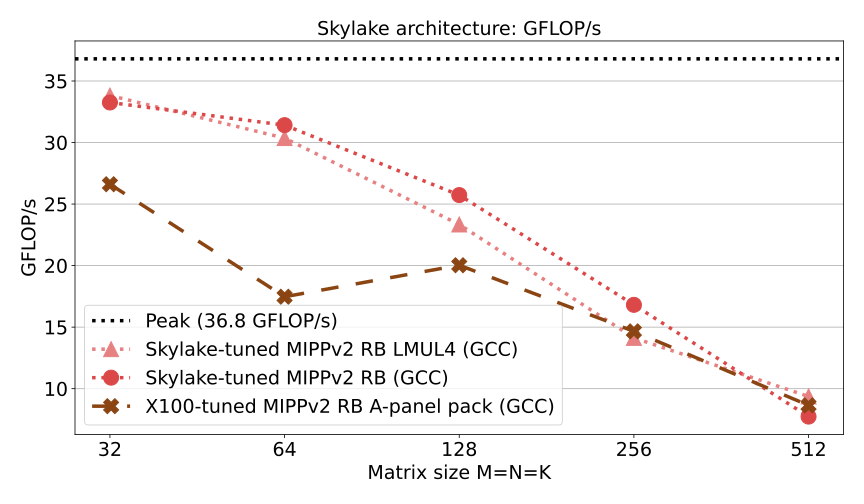
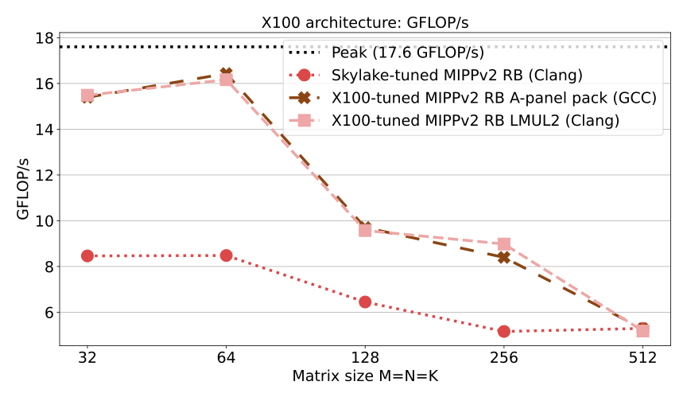
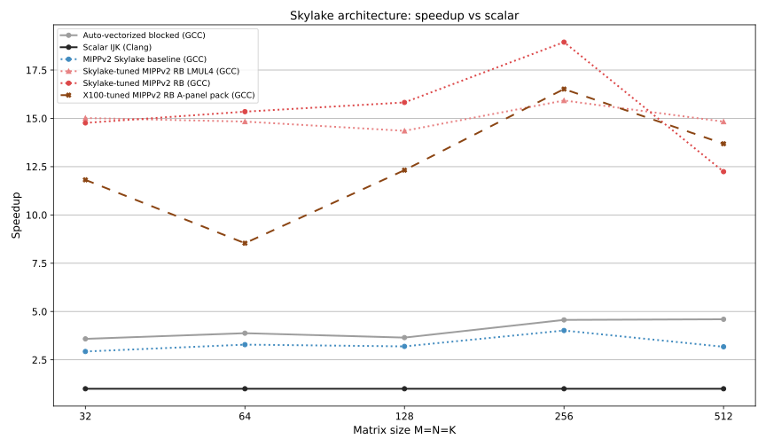
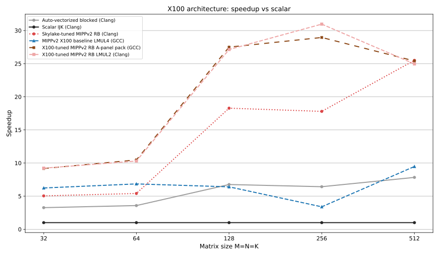

# GEMM Benchmark Suite for SpacemiT RISC-V & MIPPv2

> [!WARNING]
> **Work in Progress (WIP)**: This repository is under development. Microkernels, benchmark (and anything else to be honest) might change any time.

This repostitory contains a high-performance General Matrix Multiply (DGEMM) microbenchmark suite, built on top of [MIPPv2](https://github.com/aff3ct/MIPP/tree/develop) (MyIntrinsics++ v2).
It currently contains microbenchmarks tuned for Intel Skylake (AVX2 + FMA) and SpacemiT X100 (RVV 1.0).

> [!NOTE]
> **Origins & Context**: Developed during a research internship at **LIP6** (Sorbonne Université), this benchmark evaluates MIPPv2 as a zero-overhead abstraction layer for compute-bound microkernels (DGEMM). Key objectives included assessing cross-platform efficiency across different microarchitectures (Intel Skylake vs. SpacemiT X100) and determining whether MIPPv2 features (such as emulated LMUL on fixed-width SIMD) simplify microkernel design space exploration.
> **Repurposing & Roadmap**: This microkernel benchmark is being repurposed and actively expanded into a standalone **GEMM benchmark** and optimized kernel suite mainly targetting SpacemiT RISC-V architectures.
> - **SpacemiT K3 X100**
> - **SpacemiT K1 X60**
> - Target extension under investigation: **SpacemiT K3 A100**.
> - Potential future microkernel targets (tentative): **AMD Zen 4** (AVX-512) and **Apple Silicon M1** (ARM NEON).

---

## Performance Overview

The highest measured throughput on the SpacemiT K3 X100 reaches **16.43 GFLOP/s**, reaching **93% of the theoretical peak performance** (17.6 GFLOP/s at target clock) on a single core using the `mippv2_x100_register_blocked_apack4` microkernel. Achieving >93% hardware utilization is notable given that the X100 core was released only a few months ago and that the microkernel is written in C++ and uses an SIMD abstraction library (MIPPv2) rather than hand-crafted assembly.

> [!NOTE]
> **Scope & Experimental Caveats**:
> These benchmarks currently evaluate **isolated microkernels under idealized conditions**:
> - **Synthetic constraints:** Matrices are strictly square, power-of-two dimensions ($32 \le M,N,K \le 512$) with 64-byte SIMD/cache-line aligned allocations.
> - **No fringe/tail handling:** Dimensions are exact multiples of the vector register tiles ($M_R, N_R$), avoiding peeling or masking overheads.
> - **Absence of multi-level cache hierarchy:** Without full BLIS/GotoBLAS-style cache tiling ($M_C, K_C, N_C$ packing across L1/L2/LLC), throughput naturally drops as matrix dimensions exceed local cache capacity.
> Bridging this gap—transitioning from isolated microarchitectural microkernels to an arbitrary-dimension, cache-blocked GEMM engine—is the primary motivation for this standalone repository.

### Architecture Comparison: Skylake vs. SpacemiT X100

| Skylake (AVX2 / FMA) | SpacemiT K3 X100 (RVV 1.0, VLEN=256) |
| :---: | :---: |
| **Sustained Throughput (GFLOP/s)** | **Sustained Throughput (GFLOP/s)** |
|  |  |
| **Speedup vs. Scalar Baseline (`ijk`)** | **Speedup vs. Scalar Baseline (`ijk`)** |
|  |  |

---

## Repository Structure

```text
gemm_bench/
├── assets/                  # Performance summary figures (SVG)
├── include/
│   ├── Alloc.h              # Cache/SIMD-aligned memory allocators
│   ├── BenchConfig.h        # Benchmark configuration types
│   ├── GemmUKernel.h        # GEMM microkernel implementations
│   ├── StorageType.h        # Row-major, column-major, and packed matrix wrappers
│   └── mipp_custom.h        # Vector-scalar FMA (vfmacc.vf) extension header
├── results/
│   └── reference/           # Canonical benchmark datasets (Skylake & X100)
├── src/
│   └── main.cpp             # Benchmark driver CLI
├── tests/                   # Catch2 unit and validation tests
├── x100_uarch_exp/
│   └── broadcast_bench.cpp  # FMA & vector-broadcast microarchitectural probe
├── plot_results.py          # Fancy plotting script
├── run_benchmarks.sh        # Automated build & benchmark runner for x86
└── run_benchmarks_rvv.sh    # Automated build & benchmark runner for RVV
```

---

## Prerequisites & Dependencies

1. **C++20 Compiler**:
   - `clang++` (>= 15.0) or `g++` (>= 12.0) with RVV 1.0 support (`-march=rv64gcv`).
2. **Build System**:
   - `CMake` (>= 3.20).
3. **MIPPv2 Headers**:
   MIPPv2 headers are not vendored into this repository. You can obtain them from the official [MIPP repository on GitHub (`develop` branch)](https://github.com/aff3ct/MIPP/tree/develop) using either method:

   - **Method 1: Standalone Release Archive (Recommended)**
     Download the pre-generated headers tarball directly from the [MIPP Releases page](https://github.com/aff3ct/MIPP/releases) (e.g., v2.0.1 or v2.0.0):
     ```bash
     wget https://github.com/aff3ct/MIPP/releases/download/v2.0.1/mipp-v2.0.1-headers.tar.gz
     tar -xzf mipp-v2.0.1-headers.tar.gz
     # The extracted directory contains include/mipp.hpp, include/mipp.h, etc.
     ```

   - **Method 2: Clone from `develop` Branch & Generate**
     Clone the upstream `develop` branch and run the generator:
     ```bash
     git clone -b develop https://github.com/aff3ct/MIPP.git
     cd MIPP
     pip install -r generator/requirements.txt
     cd generator
     ./gen_mipp_headers.py --simd-ext sse avx avx512 rvv scalar
     # Generated headers will be located in MIPP/include/
     ```

4. **Python Plotting Dependencies**:
   ```bash
   pip install matplotlib pandas numpy
   ```

---

## Building

### Basic Build
Point CMake to your MIPPv2 `include` directory:

```bash
cmake -B build -S . \
  -DCMAKE_BUILD_TYPE=Release \
  -DMIPPV2_INCLUDE_DIR=/path/to/mipp/include

cmake --build build -j$(nproc)
```

### Build with Tests
Unit tests use Catch2 v3 (automatically fetched via CMake if not installed on your system):

```bash
cmake -B build -S . \
  -DCMAKE_BUILD_TYPE=Release \
  -DMIPPV2_INCLUDE_DIR=/path/to/mipp/include \
  -DGEMMBENCH_BUILD_TESTS=ON

cmake --build build -j$(nproc)
ctest --test-dir build --output-on-failure
```

---

## Running Benchmarks

### Automated x86 Execution
The `run_benchmarks.sh` script compiles multiple target configurations (scalar, SSE4.2, AVX2, native) and sweeps matrix dimensions $32 \times 32$ to $512 \times 512$:

```bash
./run_benchmarks.sh
```
Results will be exported to `results/gemm_results.csv`.

### Automated RISC-V Vector (SpacemiT X100 / X60) Execution
This script functions the same way as `run_benchmarks.sh` except it builds for RVV1.0 with fixed size VLEN=256. It also runs every ukernel for matrices ranging from 32x32 to 512x512 to map performance.

```bash
./run_benchmarks_rvv.sh
```

---

## Reproducing Figures

To regenerate the SVG figures using the included reference datasets:

```bash
python3 plot_results.py \
  --skylake-gcc results/reference/skylake_gcc.csv \
  --skylake-clang results/reference/skylake_clang.csv \
  --x100-gcc results/reference/x100_gcc.csv \
  --x100-clang results/reference/x100_clang.csv \
  --output plots
```

---

## Kernel Taxonomy & Microarchitecture Notes

> [!NOTE]
> **Kernel Pruning & Design Space Exploration**:
> This repository contains a broad variety of microkernels implemented during microkernel design space exploration (evaluating unroll factors, register tile geometries, packing schemes, and memory access orders).
> - Suboptimal or redundant kernels will eventually be pruned to maintain a focused collection of the highest-performing microkernels for each target architecture.
> - Scalar kernels (such as `ijk`, `ikj`, and naive blocked variants) are retained strictly as reference baselines for speedup calculations and vectorization efficiency analysis.

- **Scalar Baselines**: Standard triply-nested loops (`ijk`, `ikj`), basic loop blocking, and register-blocked scalar implementations.
- **Generic MIPPv2**: Direct vectorized loops parameterized across vector lengths and unrolling factors (`mippv2_lmul1/2/4/8`, `mippv2_blocked`).
- **Register Blocked**: Microkernels with accumulators kept in vector register files to maximize arithmetic intensity.
- **Panel / Packed**: GotoBLAS/BLIS-style contiguous packing for continuous streaming into vector execution units.
- **SpacemiT-Tuned Microkernels**: Microkernels exploring register pressure and dynamic vector-length configurations for SpacemiT cores ($VLEN=256$):
  - **Vector-Scalar FMA**: Uses `include/mipp_custom.h` to emit `vfmacc.vf` instructions, eliminating explicit vector broadcast (`vfmv.v.f`) overhead inside the inner accumulation loop.
  - **Register File Budgeting**: RVV provides 32 architectural vector registers. Custom tiles allocate up to 16–24 registers for accumulators while keeping A-matrix scalars and B-matrix vectors resident.

---

## Acknowledgments

- **Adrien Cassagne** ([@kouchy](https://github.com/kouchy/)) for providing access to single-board computers (SBCs) equipped with SpacemiT K1 and K3 SoCs on the [Dalek Cluster](https://dalek.proj.lip6.fr/) (*"Dalek: An Unconventional and Energy-Aware Heterogeneous Cluster"*, [arXiv:2508.10481](https://arxiv.org/abs/2508.10481)).
- **SpacemiT**, for publishing the [SpacemiT K3 Technical Whitepaper](https://forum.spacemit.com/uploads/short-url/60aJ8cYNmrFWqHn4ddwwSzMLjlY.pdf), which provided the key microarchitectural insights into the X100 core RVV implementation.
- **camel-cdr**, for creating and maintaining the [RVV Benchmark Results](https://camel-cdr.github.io/rvv-bench-results/index.html) project, an invaluable empirical reference for RISC-V Vector performance evaluation.
- The authors of *["Great Expectations: Benchmarking the Real-World Performance of RVV 1.0 in HPC"](https://arxiv.org/abs/2608.28097)* ([arXiv:2608.28097](https://arxiv.org/abs/2608.28097)), whose recent empirical findings and analysis served as one of the motivation for open-sourcing this benchmark suite :-)

---

## Generative AI Disclosure

Generative AI assistants (**Google Gemini** and **OpenAI ChatGPT**) were utilized during the development of this repository to accelerate boilerplate tasks and infrastructure setup, specifically:
- Automation scripts (shell runners and Python data parsing / plotting pipelines).
- Benchmark driver CLI scaffolding, argument handling, and boilerplate wiring in C++.
- Build system configuration and test suite plumbing.

However, the actual GEMM microkernel tuned for Skylake (AVX2 + FMA) and especially the SpacemiT K3 X100 core are the result of multiple weeks of dedicated work, hardware-level profiling, and reflection on the underlying microarchitectures and platforms.
