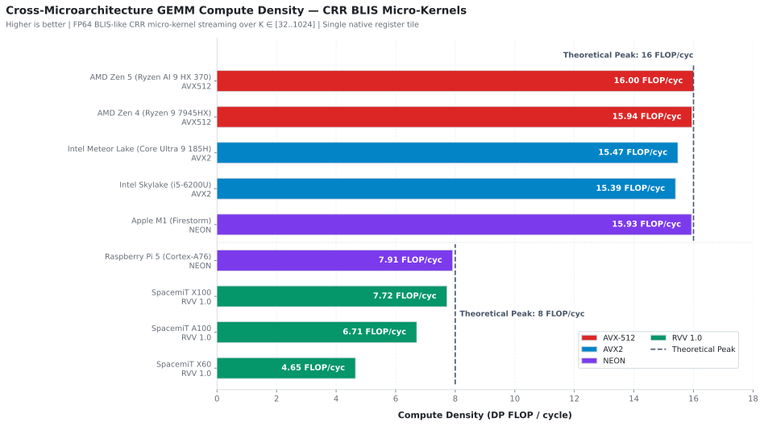
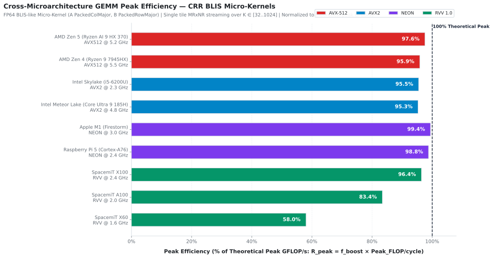

# GEMM Benchmark Suite Across Modern CPU Microarchitectures (MIPPv2)

> [!WARNING]
> **Work in progress (WIP)**: This repository is under active development. Microkernels, benchmark drivers, and analysis tools are subject to change.

A double-precision General Matrix Multiply (DGEMM) microbenchmark and exploration suite built on [MIPPv2](https://github.com/aff3ct/MIPP/tree/develop) (MyIntrinsics++ v2).

This suite evaluates DGEMM microkernels written in C++ with MIPPv2 across **9 CPU microarchitectures**: **x86_64 AVX2 & AVX-512**, **AArch64 NEON**, and **RISC-V Vector 1.0** (RVV).

> [!NOTE]
> **Context**: Developed at **LIP6** (Sorbonne Université), evaluating portable vector implementations of DGEMM microkernels using **MIPPv2** across x86-64, AArch64, and RISC-V Vector microarchitectures.

---

## Microarchitectural Evaluation & Results

The suite evaluates single-core, compute-bound double-precision GEMM microkernels under the **CRR layout** (GotoBLAS / BLIS convention: column-major packed $A$ panel with leading dimension $M_R$, row-major $B$, row-major $C$) streaming over panel depths $K \in [32..1024]$ on register tiles ($M_R \times N_R$) empirically selected to maximize throughput on each target microarchitecture.

### 1. Compute Density (DP FLOP / cycle)

Figure 1 evaluates microarchitectural execution efficiency independently of core clock frequency, measuring physical floating-point operations completed per clock cycle against hardware FMA issue capacity :

<p align="center">
  
</p>

### 2. Sustained DGEMM Efficiency (% of Theoretical Peak GFLOP/s)

Figure 2 reports sustained throughput relative to rated single-core burst frequency ceilings ($R_{\text{achieved}} / R_{\text{peak}} \times 100$), reflecting frequency scaling and thermal dissipation under sustained dense vector execution:

<p align="center">
  
</p>

### Microarchitectural Hardware Execution Summary

The table below reconciles execution unit pipeline saturation with rated system throughput by measuring effective operating frequency ($f_{\text{eff}} = \text{Cycles} / \text{Time}$) via Linux `perf_event_open` hardware cycle counters alongside rated burst clocks ($f_{\text{boost}}$):

| SIMD | Microarchitecture | CPU Model | Champion Kernel | Tile ($M_R \times N_R$) | Comp | Pipe Saturation (%) | FLOP/cycle | $f_{\text{eff}}$ (GHz) | $f_{\text{boost}}$ (GHz) | Achieved (GFLOP/s) | Peak Theo (GFLOP/s) | % Peak Theo |
|:---|:---|:---|:---|:---:|:---:|:---:|:---:|:---:|:---:|:---:|:---:|:---:|
| AVX512 | AMD Zen 5 Strix Point | Ryzen AI 9 HX 370 | `mippv2_firestorm_mr4_nr4_fmaddi_crr` | 4x32 | gcc | **100.0%** | 16.00 / 16 | 5.10 | 5.16 | 81.6 | 82.5 | 98.9% |
| AVX512 | AMD Zen 4 | Ryzen 9 7945HX | `mippv2_firestorm_mr4_nr4_fmaddi_crr` | 4x32 | gcc | **99.7%** | 15.95 / 16 | 5.35 | 5.46 | 85.3 | 87.4 | 97.6% |
| AVX2 | Intel Meteor Lake | Core Ultra 9 185H | `mippv2_meteorlake_mr4_nr3_crr` | 4x12 | clang | **96.5%** | 15.43 / 16 | 4.77 | 4.78 | 73.6 | 76.5 | 96.2% |
| AVX2 | Intel Skylake | i5-6200U | `mippv2_meteorlake_mr4_nr3_crr` | 4x12 | clang | **96.2%** | 15.39 / 16 | 2.28 | 2.30 | 35.1 | 36.8 | 95.5% |
| NEON | Apple M1 | Firestorm | `mippv2_x60_mr6_nr4_fmaddi_crr` | 6x8 | gcc | **99.6%** | 15.93 / 16 | 3.03 | 3.04 | 48.3 | 48.6 | 99.4% |
| NEON | Raspberry Pi 5 | Cortex-A76 | `mippv2_a76_mr6_nr4_fmaddi_crr` | 6x8 | gcc | **99.1%** | 7.93 / 8 | 2.39 | 2.40 | 19.0 | 19.2 | 98.7% |
| RVV | SpacemiT X100 | SpacemiT X100 | `mippv2_x100_register_blocked_apack4_crr` | 3x16 | clang | **96.5%** | 7.72 / 8 | 2.40 | 2.40 | 18.5 | 19.2 | 96.4% |
| RVV | SpacemiT A100 | SpacemiT A100 | `mippv2_a100_mr7_nr2_lmul2_pipe_crr` | 7x64 | gcc | **83.7%** | 6.69 / 8 | 1.99 | 2.00 | 13.3 | 16.0 | 83.3% |
| RVV | SpacemiT X60 | SpacemiT X60 | `mippv2_a100_mr7_nr4_pipe_crr` | 7x16 | clang | **58.1%** | 4.65 / 8 | 1.60 | 1.60 | 7.4 | 12.8 | 58.0% |

> **Microarchitectural Findings:**
> - **Execution Pipeline Saturation vs. Thermal Scaling:** On AMD Zen 4, the vector FMA datapath reaches 15.95 / 16.0 FLOP/cycle (99.7% pipeline saturation). The gap to the rated 87.4 GFLOP/s ceiling is attributable to clock throttling under continuous 512-bit vector execution ($f_{\text{eff}} = 5.35\text{ GHz}$ vs. $f_{\text{boost}} = 5.46\text{ GHz}$).
> - **Out-of-Order Execution Efficiency:** Apple M1 (Firestorm), AMD Zen 5 (Strix Point), and ARM Cortex-A76 achieve $\ge 99\%$ pipeline issue saturation, indicating balanced register tiling and effective memory latency hiding in L1 cache.
> - **Mobile Datapath Ceilings:** AMD Zen 5 on mobile Strix Point implements dual 256-bit physical FMA datapaths (double-pumped 512-bit execution), yielding a physical ceiling of 16 DP FLOP/cycle (identical to Zen 4) rather than the 32 DP FLOP/cycle ceiling of desktop/server Zen 5.
> - **Intel Meteor Lake Frequency Stabilization:** Under sustained dense 256-bit AVX2 FMA execution, power management stabilizes the Redwood Cove P-core operating frequency at 4.77 GHz (calibrated empirically via `cpufp`, 76.5 GFLOP/s ceiling) compared to its 5.10 GHz light-load burst ceiling.
> - **RISC-V Vector Scaling & In-Order Pipeline Constraints:** On SpacemiT X100, the kernel achieves 7.72 / 8.0 FLOP/cycle (96.5% saturation). In contrast, both SpacemiT X60 and A100 are **in-order dual-issue** microarchitectures where the lack of dynamic instruction reordering exposes load-to-use stalls, limiting pipeline saturation to 58.1% on X60 (4.65 / 8 FLOP/cycle) and 83.7% on A100 (6.69 / 8 FLOP/cycle).

---

### 3. Native BLIS Assembly vs. Portable MIPPv2 C++ Comparison

To establish an absolute performance reference against industry-standard hand-tuned kernels, GEMMBench incorporates native assembly microkernels from the [BLIS framework](https://github.com/flame/blis) under strictly identical in-cache CRR packing conditions ($A$ column-major $M_R \times K$, $B$ row-major $K \times N_R$, $C$ row-major $M_R \times N_R$):

| Architecture / SIMD | Native BLIS Reference Kernel | Geometry ($M_R \times N_R$) | Implementation |
| :--- | :--- | :---: | :--- |
| **x86-64 AVX-512** (Zen 4, Zen 5) | `skx_d16x14.c` | $16 \times 14$ | Inline GNU assembly, 32 ZMM registers |
| **x86-64 AVX2** (Meteor Lake, Skylake) | `haswell_d6x8.c` | $6 \times 8$ | Inline GNU assembly, 16 YMM registers |
| **AArch64 NEON** (M1, Cortex-A76) | `armv8a_d6x8.c` | $6 \times 8$ | Inline GNU assembly, 32 V-registers |
| **RISC-V Vector 1.0** (SpacemiT X60) | `dgemm_x60_2vx14.c` | $2\text{v} \times 14$ ($8 \times 14$) | Inline assembly with genetic algorithm scheduling |

#### Comparative Performance Across Microarchitectures

The table below compares the peak sustained throughput and compute density between MIPPv2 C++ champion kernels and native BLIS assembly across all evaluated platforms (sweeping panel depth $K \in [32..1024]$ with 15 repetitions and 3 replicated runs):

| Platform | Compiler | MIPPv2 Champion | MIPPv2 (FLOP/cyc) | BLIS (FLOP/cyc) | **MIPPv2 / BLIS (%)** | Microarchitectural Regime |
| :--- | :---: | :--- | :---: | :---: | :---: | :--- |
| **AMD Zen 5** | gcc | `mippv2_firestorm_mr4_nr4_fmaddi_crr` ($4\times32$) | 16.00 | 15.98 | **100.2%** | Parity (Out-of-order FMA saturation) |
| **AMD Zen 4** | gcc | `mippv2_firestorm_mr4_nr4_fmaddi_crr` ($4\times32$) | 15.95 | 15.94 | **100.1%** | Parity (Out-of-order FMA saturation) |
| **Intel Meteor Lake** | clang | `mippv2_meteorlake_mr4_nr3_crr` ($4\times12$) | 15.43 | 15.45 | **99.9%** | Parity (AVX2 Redwood Cove saturation) |
| **Apple M1** | gcc | `mippv2_x60_mr6_nr4_fmaddi_crr` ($6\times8$) | 15.93 | 15.81 | **100.8%** | Parity (+30% MIPPv2 advantage at $K=32$) |
| **Raspberry Pi 5** | gcc | `mippv2_a76_mr6_nr4_fmaddi_crr` ($6\times8$) | 7.93 | 7.85 | **101.0%** | Parity (+40% MIPPv2 advantage at $K=32$) |
| **SpacemiT X100** | clang | `mippv2_x100_register_blocked_apack4_crr` ($3\times16$) | 7.72 | 7.52 | **102.6%** | MIPPv2 advantage at $K \le 256$ |
| **SpacemiT X60** | clang | `mippv2_a100_mr7_nr4_pipe_crr` ($7\times16$) | 4.65 | 6.43 | **72.2%** | BLIS advantage (+28%, static dual-issue scheduling) |
| **SpacemiT A100** | gcc | `mippv2_a100_mr7_nr2_lmul2_pipe_crr` ($7\times64$) | 6.69 | 1.84 | *(365%)*\* | MIPPv2 custom tile ($LMUL=2$, VLEN=1024) |

*\* Note on SpacemiT A100: The native BLIS RVV kernel was engineered specifically for SpacemiT X60 (VLEN=256, in-order dual-issue). On A100 (VLEN=1024), this kernel suffers severe pipeline hazards due to geometry mismatch ($8 \times 14$ vs native $7 \times 64$). MIPPv2 demonstrates the advantage of algorithmic portability by dynamically sizing the tile to the hardware vector length.*

> **Microarchitectural Insights on C++ vs. Assembly:**
> 1. **Out-of-Order Latency Hiding:** On out-of-order cores (Zen 4, Zen 5, Firestorm, Cortex-A76), modern compilers (GCC 13/14, Clang 18) unroll and pipeline MIPPv2 vector intrinsics to within **0.1% to 0.8%** of hand-crafted assembly. Furthermore, MIPPv2 outperforms BLIS on small panel depths ($K \in [32..64]$) by up to **+40%** due to direct in-register tile unrolling without function call or loop fringe overheads.
> 2. **In-Order Dual-Issue Constraints:** On the SpacemiT X60 (in-order dual-issue RVV 1.0), BLIS outperforms MIPPv2 by **+28%** (6.43 vs 4.65 FLOP/cycle). Because the in-order pipeline cannot dynamically reorder instructions, BLIS relies on offline genetic algorithm scheduling with interleaved NOPs and load hoisting to avoid execution stalls that C++ compilers currently fail to eliminate.
> 3. **L1d vs. L2 Working Set Spill ($K=128$):** For register tiles with $M_R \times N_R$, as depth $K$ increases beyond 128, working set size exceeds 48 KiB and spills from L1d into L2 cache. The scaling curves reveal that both MIPPv2 and BLIS transition from compute-bound saturation to L2 latency-bound execution, annotated in the comparison figures.

Detailed comparison reports and vector scaling figures are generated via:
```bash
python3 tools/compare_mippv2_blis.py --input-dir gemm-bench-results/blis_comparison --plot
```

---

### Methodological Scope & Measurement Protocol

To ensure reproducibility and isolate microarchitectural behavior, the benchmark suite enforces the following constraints:

1. **In-Cache Register Tile Scope**:
   - Evaluates the innermost $K$-loop on pre-packed panels $A$ ($M_R \times K$, column-major) and $B$ ($K \times N_R$, row-major) accumulating into an in-register tile ($M_R \times N_R$) and writing to $C$.
   - Cache-blocking hierarchy overheads (GotoBLAS / BLIS: $J_C, P_C, I_C, J_R, I_R$) and dynamic matrix packing into memory buffers are excluded.
2. **Canonical GEMM Regime**:
   - Evaluates the compute-bound canonical form $\alpha = 1.0, \beta = 0.0$ ($C \leftarrow AB$), where throughput is computed as $\text{GFLOP/s} = \frac{2 \times M \times N \times K}{\text{Time (seconds)} \times 10^9}$. Non-canonical operations ($\beta \neq 0.0$) introduce load-scale-accumulate overheads on $C$ that are validated functionally but excluded from peak throughput claims.
3. **Tile Geometry & Boundary Conditions**:
   - Panel dimensions $M, N$ match the register tile $M_R, N_R$, and depth $K$ aligns with 4-way unrolling. While all kernels include scalar/vector fringe handling for functional correctness, edge handling is excluded from peak saturation measurements.
4. **Single-Thread FP64 Scope**:
   - All measurements evaluate single-thread IEEE-754 double precision (`double` / FP64).
5. **Multi-Repetition Sampling & Median Filtering**:
   - Each measurement collects $R = 15$ timed samples over hundreds of thousands to millions of kernel invocations. Timings report the median duration alongside standard deviation and intra-run coefficient of variation ($\text{CV} = \frac{\sigma}{\mu} \times 100\,\%$).
6. **Multi-Run Replication & Inter-Run CV Monitoring**:
   - Benchmarks execute $N_{\text{runs}} = 3$ independent processes per configuration. An automatic warning is raised if inter-run variation exceeds 5%.
7. **Compiler Optimization & Monotonic Timing Barriers**:
   - Monotonic timestamps (`std::chrono::steady_clock::now()`) are isolated by `asm volatile("" ::: "memory")` compiler barriers. Dead-code elimination is prevented via clobbered read barriers on matrix pointers (`asm volatile("" :: "r"(C.data) : "memory")`).
8. **Hardware Cycle Counting via `perf_event_open`**:
   - On Linux systems, unprivileged hardware performance counters (`PERF_COUNT_HW_CPU_CYCLES`) record exact CPU cycles elapsed during the timed loop, computing true $\text{FLOP/cycle} = \frac{2 \times M \times N \times K}{\text{Cycles}}$ and effective operating frequency ($f_{\text{eff}} = \frac{\text{Cycles}}{\text{Time} \times 10^9}$).
9. **Platform Isolation & Thermal Management**:
   - Processes are pinned to a dedicated physical core via `taskset`. Thermal cooldown pauses ($2.0\,\text{s}$) are inserted between sizes for $K \ge 256$ to mitigate heat accumulation. Core frequency is passively monitored via `cpufreq/scaling_cur_freq` to detect throttling.
10. **Numerical Validation**:
    - Microkernel output is verified against a pure scalar IEEE-754 FP64 reference computation before benchmarking.

---

## Prerequisites & Building

### 1. Requirements
- **C++20 Compiler**: `g++` (>= 12.0) or `clang++` (>= 15.0).
- **CMake**: version 3.20 or newer.
- **Python**: 3.9+ with `matplotlib`, `pandas`, `numpy`.
- **MIPPv2 Headers**: Obtain the headers from the [MIPP develop branch](https://github.com/aff3ct/MIPP/tree/develop) or download from [MIPP Releases](https://github.com/aff3ct/MIPP/releases).

### 2. Standalone Build
```bash
cmake -B build -S . \
  -DCMAKE_BUILD_TYPE=Release \
  -DMIPPV2_INCLUDE_DIR=/path/to/mipp/include \
  -DGEMMBENCH_ENABLE_BLIS=ON \
  -DGEMMBENCH_BLIS_TARGET=AUTO

cmake --build build -j$(nproc)
```

| CMake Option | Default | Description |
| :--- | :--- | :--- |
| `-DGEMMBENCH_ENABLE_BLIS` | `ON` | Compile and link native BLIS reference assembly microkernels (`blis_native`) |
| `-DGEMMBENCH_BLIS_TARGET` | `AUTO` | Explicit target override: `AUTO`, `SKX` (AVX-512 $16\times14$), `HASWELL` (AVX2 $6\times8$), `ARMV8A` (NEON $6\times8$), `X60` (RVV $2\text{v}\times14$) |
| `-DGEMMBENCH_BUILD_TESTS` | `OFF` | Build Catch2 unit test suite (`GemmBenchTests`) |
| `-DGEMMBENCH_ENABLE_FASTMATH` | `ON` | Fast math flags (`-ffast-math`). Use `OFF` for strict IEEE-754 mode (`-ffp-contract=fast`) |
| `-DGEMMBENCH_ENABLE_EXPLO` | `OFF` | Enable exploratory experimental microkernel implementations |

### 3. Build and Run Unit Tests
Unit tests use Catch2 v3 (automatically fetched if not present on system):
```bash
cmake -B build -S . \
  -DCMAKE_BUILD_TYPE=Release \
  -DMIPPV2_INCLUDE_DIR=/path/to/mipp/include \
  -DGEMMBENCH_BUILD_TESTS=ON

cmake --build build -j$(nproc)
ctest --test-dir build --output-on-failure
```

---

## Running Benchmarks

Benchmarks are driven by `./run_benchmarks.sh <platform> [options] [compilers...]`.

Always specify `-o <uarch>_<simd>` to ensure non-colliding, standardized result files:

```bash
# Benchmark Intel Skylake (AVX2) with GCC and Clang
./run_benchmarks.sh avx2 -o skylake_avx2 gcc clang

# Benchmark Intel Meteor Lake (AVX2) on specific matrix sizes
./run_benchmarks.sh avx2 -o meteorlake_avx2 -s 32 -s 64 -s 96 -s 128 gcc clang

# Benchmark AMD Zen 4 (AVX-512) pinned to core 0 with 15 repetitions and 3 runs
./run_benchmarks.sh avx512 -o zen4_avx512 -c 0 -r 15 --runs 3 gcc clang

# Benchmark SpacemiT X100 with clean rebuild
./run_benchmarks.sh rvv_x100 -o x100_rvv --rebuild clang

# Benchmark CRR kernels only (BLIS-like K sweep on native MR×NR tile)
./run_benchmarks.sh avx512 --crr -o zen4_avx512 gcc clang
```

### Benchmark Driver CLI Options

| Flag | Argument | Description | Default |
| :--- | :--- | :--- | :--- |
| `-o, --output, --prefix` | `<prefix>` | Suffix tag for generated CSV files (`results/gemm_results_<prefix>_...`) | `""` |
| `--crr, --crr-only` | — | Benchmark only CRR microkernels (GotoBLAS / BLIS register tile layout) | `false` |
| `--rrr, --rrr-only` | — | Benchmark only legacy RRR baseline microkernels | `false` |
| `-r, --repetitions` | `<N>` | Number of timed repetitions per size/kernel sample | `15` |
| `--runs, --repeats` | `<N>` | Number of full benchmark passes to compute inter-run CV | `3` |
| `--cooldown` | `<sec>` | Cooldown sleep between sizes for $K \ge 256$ (thermal throttle mitigation) | `2.0` |
| `--validate` | — | Validate numerical correctness against scalar reference before benchmarking | `false` |
| `-c, --core` | `<id>` | Pin benchmark execution to a specific CPU core via `taskset` | Config default (e.g. core 1) |
| `--no-pin` | — | Disable core affinity pinning | `false` |
| `-s, --size` | `<K>` | Evaluate specific panel depth $K$ (can be repeated) | Config defaults |
| `-k, --kernel` | `<name>` | Benchmark only a specific microkernel | All in config |
| `--explo` | — | Enable exploratory kernels (`-DGEMMBENCH_ENABLE_EXPLO=ON`) | `false` |
| `--run-all` | — | Run all versions (including scalar baseline) and exploratory kernels | `false` |
| `--rebuild` | — | Force clean rebuild of target executables before benchmarking | `false` |
| `--tests` | — | Build and run Catch2 unit tests before benchmarking | `false` |
| `--tests-only` | — | Build and run Catch2 unit tests only, then exit | `false` |

---

## Plotting & Performance Analysis

All figures are generated as clean, publication-ready vector **SVG** graphics with automatically trimmed bounding boxes (`bbox_inches="tight"`).

### RRR Plots

The analytical suite `plot_results.py` reads the hierarchical hardware specification in `uarch_config.json`, scans the benchmark datasets, identifies the champion kernel for each microarchitecture, and outputs comparison plots:

```bash
# Generate all RRR plots from reference datasets
python3 plot_results.py --input-dir gemm-bench-results --output plots

# Filter specific architectures or SIMD extensions
python3 plot_results.py --input-dir gemm-bench-results --uarch zen4 zen5 m1
python3 plot_results.py --input-dir gemm-bench-results --simd avx512 neon

# Override clock frequencies (in GHz) for dynamic boost clock analysis
python3 plot_results.py --input-dir gemm-bench-results --freq zen4=5.4,m1=3.0
```

### CRR Plots

`plot_results_crr.py` analyzes CRR micro-kernel benchmark results with automatic champion selection and FLOP/cycle efficiency. It can optionally generate side-by-side comparisons against RRR baselines:

```bash
# Generate all CRR plots (auto-detects gemm-bench-results/crr/)
python3 plot_results_crr.py --output plots_crr

# With side-by-side CRR vs RRR comparison
python3 plot_results_crr.py --output plots_crr --compare-rrr gemm-bench-results

# Filter specific architectures
python3 plot_results_crr.py --uarch zen4 m1 x100 --output plots_crr
```

### Output Figures
- **`plots/`** (RRR):
  - `cross_uarch_efficiency_comparison.svg`: Multi-architecture comparison in **% of theoretical peak**.
  - `cross_uarch_flop_cycle_comparison.svg`: Multi-architecture comparison in **DP FLOP/cycle**.
  - `<simd>_<uarch>_overview.svg`: Per-architecture detailed breakdown.
- **`plots_crr/`** (CRR):
  - `cross_uarch_crr_flop_cycle_comparison.svg`: CRR physical compute density (DP FLOP/cycle) against theoretical issue ceilings (8 and 16 FLOP/cyc).
  - `cross_uarch_crr_efficiency_comparison.svg`: CRR sustained efficiency (% of theoretical peak GFLOP/s: Achieved / $R_{\text{peak}}$).
  - `crr_hardware_summary_table.md`: Comprehensive microarchitectural hardware execution summary table.
  - `cross_uarch_crr_vs_rrr_comparison.svg`: CRR vs RRR speedup (with `--compare-rrr`).
  - `<simd>_<uarch>_crr_overview.svg`: Per-architecture CRR breakdown.

---

## Developer Tutorial: Adding a New Microkernel

This guide walks through implementing, registering, testing, benchmarking, and analyzing a new GEMM microkernel across the entire pipeline. The repository supports two principal layouts:
- **CRR (GotoBLAS / BLIS packing)**: Column-major packed $A$ ($M_R \times K$, leading dimension $M_R$), Row-major $B$ ($K \times N_R$), Row-major $C$ ($M_R \times N_R$). This matches the GotoBLAS / BLIS register-tiled microkernel convention.
- **RRR (Legacy)**: Row-major packed $A, B, C$.

---

### Step 1: Implement the Microkernel in C++

CRR microkernels are implemented in [`include/microkernels/GemmUKernel_opti_crr.hpp`](include/microkernels/GemmUKernel_opti_crr.hpp). RRR microkernels reside in [`include/microkernels/GemmUKernel_opti_rrr.hpp`](include/microkernels/GemmUKernel_opti_rrr.hpp). Exploratory kernels go in [`include/microkernels/GemmUKernel_explo.hpp`](include/microkernels/GemmUKernel_explo.hpp).

#### 1. Choose Register Tile Geometry ($M_R \times N_R$)
- $M_R$ rows $\times$ $N_R$ columns, with $N_R = N_V \times VL$ ($N_V$ vectors wide, $VL = \text{vlen}$).
- **Accumulator vector registers**: $M_R \times N_V = M_R \times \lceil N_R / VL \rceil$.
  - Example: a $4 \times 3VL$ tile on AVX2 ($M_R=4, N_V=3$, 4 doubles/vector): $4 \times 3 = 12$ accumulator registers, leaving 4 registers for $B$ broadcast operands and memory addresses within the 16 architectural registers of x86-64.
  - On 32-register architectures (AVX-512, AArch64 NEON, RVV), tiles like $4 \times 4VL$ (16 accumulators) or $6 \times 4VL$ (24 accumulators) provide optimal pipeline depth.
- Ensure the accumulator budget plus operand registers fits within architectural limits with zero stack spilling.

#### 2. CRR Implementation Pattern
A production CRR microkernel features:
1. **Single-Tile Fast Path**: Dedicated compute loop for $M = M_R$ and $N = N_R$, unrolled along $K$ (typically 4-way with `#pragma GCC unroll 4`) with a scalar cleanup loop for remainder $K \pmod 4$.
2. **Multi-Tile Fallback & Fringes**: Outer $i, j$ loops with edge handling for complete matrix operations.
3. **Epilogue Vector Stores**: `Epilogue::store<T, lmul, FastPath>()` handling both the canonical fast path ($\alpha = 1, \beta = 0$) and full $(\alpha, \beta)$ scaling/accumulation.

```cpp
// In include/microkernels/GemmUKernel_opti_crr.hpp (inside template <typename T> class GemmUKernel):
template <int lmul = 1, bool FastPath = false>
static inline void
gemm_mippv2_mykernel_crr_core(const PackedColMajor<T> &__restrict A,
                              const PackedRowMajor<T> &__restrict B,
                              PackedRowMajor<T> &__restrict C,
                              T alpha = T{1}, T beta = T{0}) {
  using namespace mipp;

  constexpr size_t VL = N<T, lmul>();
  constexpr size_t MR = 4;
  constexpr size_t NR = 3 * VL;

  const size_t a_ld = A.ld;
  const size_t b_ld = B.ld;
  const size_t c_ld = C.ld;
  const size_t K = A.cols;

  // 1. Fast Path: Single micro-tile (in-cache microkernel benchmark mode)
  if (__builtin_expect(A.rows == MR && B.cols == NR, 1)) {
    const T *__restrict a_k = A.data;
    const T *__restrict b_k = B.data;

    auto c00 = set0<T, lmul>(); auto c01 = set0<T, lmul>(); auto c02 = set0<T, lmul>();
    auto c10 = set0<T, lmul>(); auto c11 = set0<T, lmul>(); auto c12 = set0<T, lmul>();
    auto c20 = set0<T, lmul>(); auto c21 = set0<T, lmul>(); auto c22 = set0<T, lmul>();
    auto c30 = set0<T, lmul>(); auto c31 = set0<T, lmul>(); auto c32 = set0<T, lmul>();

    const size_t K4 = (K / 4) * 4;
    for (size_t k = 0; k < K4; k += 4) {
      #pragma GCC unroll 4
      for (size_t s = 0; s < 4; ++s) {
        const auto b0 = load<T, lmul>(b_k + s * b_ld);
        const auto b1 = load<T, lmul>(b_k + s * b_ld + VL);
        const auto b2 = load<T, lmul>(b_k + s * b_ld + 2 * VL);

        const T *a_s = a_k + s * a_ld;
        const auto a0 = set1<T, lmul>(a_s[0]);
        c00 = fmadd(a0, b0, c00); c01 = fmadd(a0, b1, c01); c02 = fmadd(a0, b2, c02);

        const auto a1 = set1<T, lmul>(a_s[1]);
        c10 = fmadd(a1, b0, c10); c11 = fmadd(a1, b1, c11); c12 = fmadd(a1, b2, c12);

        const auto a2 = set1<T, lmul>(a_s[2]);
        c20 = fmadd(a2, b0, c20); c21 = fmadd(a2, b1, c21); c22 = fmadd(a2, b2, c22);

        const auto a3 = set1<T, lmul>(a_s[3]);
        c30 = fmadd(a3, b0, c30); c31 = fmadd(a3, b1, c31); c32 = fmadd(a3, b2, c32);
      }
      b_k += 4 * b_ld;
      a_k += 4 * a_ld;
    }

    // Remainder loop along K
    for (size_t k = K4; k < K; ++k) {
      const auto b0 = load<T, lmul>(b_k);
      const auto b1 = load<T, lmul>(b_k + VL);
      const auto b2 = load<T, lmul>(b_k + 2 * VL);
      b_k += b_ld;

      const auto a0 = set1<T, lmul>(a_k[0]);
      c00 = fmadd(a0, b0, c00); c01 = fmadd(a0, b1, c01); c02 = fmadd(a0, b2, c02);
      // ... repeat for a1, a2, a3 ...
      a_k += a_ld;
    }

    // Write back via epilogue
    Epilogue::store<T, lmul, FastPath>(C[0] + 0 * VL, c00, alpha, beta);
    Epilogue::store<T, lmul, FastPath>(C[0] + 1 * VL, c01, alpha, beta);
    Epilogue::store<T, lmul, FastPath>(C[0] + 2 * VL, c02, alpha, beta);
    // ... repeat stores for rows C[1], C[2], C[3] ...
    return;
  }

  // 2. Multi-tile loops and tail cleanup (for full matrix support) ...
}

// Dispatch wrappers:
template <int lmul = 1>
static inline void
gemm_mippv2_mykernel_crr(const PackedColMajor<T> &__restrict A,
                         const PackedRowMajor<T> &__restrict B,
                         PackedRowMajor<T> &__restrict C) {
  gemm_mippv2_mykernel_crr_core<lmul, true>(A, B, C);
}

template <int lmul = 1>
static inline void
gemm_mippv2_mykernel_crr(const PackedColMajor<T> &__restrict A,
                         const PackedRowMajor<T> &__restrict B,
                         PackedRowMajor<T> &__restrict C,
                         T alpha, T beta) {
  if (__builtin_expect(alpha == T{1} && beta == T{0}, 1)) {
    gemm_mippv2_mykernel_crr_core<lmul, true>(A, B, C);
  } else {
    gemm_mippv2_mykernel_crr_core<lmul, false>(A, B, C, alpha, beta);
  }
}
```

---

### Step 2: Register in `include/microkernels/GemmUKernel.h`

1. **Add to `UKernelType`**:
   ```cpp
   enum class UKernelType {
     // ...
     mippv2_mykernel_crr,
   };
   ```

2. **Add Descriptor to `kernelTable`**:
   ```cpp
   {UKernelType::mippv2_mykernel_crr, "mippv2_mykernel_crr", CRR, 64, 4, 3},
   ```
   - **Packing constant**: `CRR` (`{PLayout::Col, PLayout::Row, PLayout::Row}`) for Col-Row-Row, or `RRR` for Row-Row-Row.
   - **Tile parameters**: `MR` (e.g. `4`) and `NR_vec` (e.g. `3` for $3 \times VL$). These values are used by `src/main.cpp` and `run_benchmarks.sh` to configure auto-sizing in CRR mode ($M = M_R, N = N_R \times VL$).

---

### Step 3: Wire Dispatch in `src/main.cpp`

[`src/main.cpp`](src/main.cpp) defines **three distinct overloads** of `run()` based on matrix layout combinations:
1. `run(cfg, gemm, PackedRowMajor<T> A, PackedRowMajor<T> B, PackedRowMajor<T> C)` $\rightarrow$ **RRR** kernels.
2. `run(cfg, gemm, PackedRowMajor<T> A, PackedColMajor<T> B, PackedRowMajor<T> C)` $\rightarrow$ **RCR** kernels.
3. `run(cfg, gemm, PackedColMajor<T> A, PackedRowMajor<T> B, PackedRowMajor<T> C)` $\rightarrow$ **CRR** kernels.

> [!CAUTION]
> You **must** add your CRR kernel dispatch branch inside the **3rd overload** (`PackedColMajor<T> A`):
> ```cpp
> case UKernelType::mippv2_mykernel_crr:
>   BENCH_KERNEL_FASTPATH(
>       gemm.gemm_mippv2_mykernel_crr(A, B, C),
>       gemm.gemm_mippv2_mykernel_crr(A, B, C, cfg.alpha, cfg.beta));
> ```
> Adding a CRR kernel to the RRR overload will cause a runtime exception (`"Kernel incompatible with RRR packing"`).

---

### Step 4: Add Unit Tests in `tests/GemmUKernelTest.cpp`

Unit tests use Catch2 v3. For a CRR kernel, register test cases in the CRR sections of [`tests/GemmUKernelTest.cpp`](tests/GemmUKernelTest.cpp):

1. **Nominal & Edge Dimension Tests**:
   ```cpp
   // Inside testGemmSuite<T, PackedColMajor<T>, PackedRowMajor<T>, PackedRowMajor<T>>()
   TEST_KERNEL("MIPPv2 MyKernel CRR",
               gemm.gemm_mippv2_mykernel_crr(A, B, C_test));
   ```
2. **$\alpha, \beta$ Scaling & Accumulation Tests**:
   ```cpp
   // Inside testGemmSuiteAlphaBeta() for CRR
   SECTION("mippv2_mykernel_crr") {
     resetMatrix(C_test, C_init);
     gemm.gemm_mippv2_mykernel_crr(A, B, C_test, p.alpha, p.beta);
     checkMatrixEqual(C_ref, C_test);
   }
   ```
3. **Execute the Test Suite**:
   ```bash
   cmake -B build -DGEMMBENCH_BUILD_TESTS=ON && cmake --build build
   ctest --test-dir build --output-on-failure
   ```

---

### Step 5: Benchmark Driver Integration

1. In [`run_benchmarks.sh`](run_benchmarks.sh), add the kernel identifier to `UNIVERSAL_KERNELS`:
   ```bash
   mippv2_mykernel_crr
   ```
2. If the kernel is designated as the champion for an architecture, update `TARGET_CHAMPIONS` in [`tools/run_cluster_benchmarks.sh`](tools/run_cluster_benchmarks.sh):
   ```bash
   [myarch]="mippv2_mykernel_rrr mippv2_mykernel_crr"
   ```
3. Run the hardened benchmark driver locally or on cluster nodes:
   ```bash
   # Benchmark CRR microkernel only (K sweep on native register tile)
   ./run_benchmarks.sh avx2 -o myarch_avx2 --crr-only -k mippv2_mykernel_crr gcc clang
   ```

---

### Step 6: Configure in `uarch_config.json` & Plot

In [`uarch_config.json`](uarch_config.json), configure the expected champion kernels and CSV patterns:
```json
"myarch": {
  "name": "My Architecture",
  "cpu_model": "Core Model",
  "frequency_ghz": 3.5,
  "peak_flop_per_cycle": 16.0,
  "expected_best_kernel": "mippv2_mykernel",
  "expected_best_kernel_crr": "mippv2_mykernel_crr",
  "csv_pattern": "*gemm_results_*myarch*_{compiler}.csv",
  "crr_csv_pattern": "*gemm_results_*myarch*crr*_{compiler}.csv"
}
```

Generate updated publication figures:
```bash
# Generate CRR overview, cross-uarch comparison, and RRR speedup SVG plots:
python3 plot_results_crr.py --output plots_crr --compare-rrr gemm-bench-results/rrr
```

---

**Current Focus & Roadmap (Prioritized TODO)**:
1. **Single-Precision Support (SGEMM / FP32)**: Extend the benchmark suite and microkernel generators to evaluate FP32 as well.
2. **Comparison with Hand-Written Native Intrinsics**: Implement intrinsics baselines (native RVV `riscv_vector.h`, AVX-512 `immintrin.h`, NEON `arm_neon.h`) to measure the exact abstraction overhead introduced by MIPPv2.
3. **Cross-SIMD Abstraction Comparisons**: Benchmark against alternative SIMD abstraction frameworks, like **Google Highway**, **EVE**, and **`std::simd`**.
4. **Non-Canonical GEMM Evaluation**: Benchmark throughput and epilogue overhead for non-canonical forms ($\beta \neq 0.0$, $\alpha \neq 1.0$) to quantify the cost of $C$ tile reloads and scaling.

> [!NOTE]
> **Completed Milestones**:
> - **Direct Microkernel Comparison Against Native BLIS Assembly**: Integrated reference assembly microkernels from BLIS across AVX-512 (`skx_d16x14.c`), AVX2 (`haswell_d6x8.c`), NEON (`armv8a_d6x8.c`), and RVV 1.0 (`dgemm_x60_2vx14.c`) with full automated comparative analysis via `tools/compare_mippv2_blis.py`.
> - **Cluster-Wide Multi-Architecture Campaign Refresh (Dalek)**: Re-run full 8-architecture sweep under hardened protocol ($R = 15$, $N_{\text{runs}} = 3$, atomic CSV output, Linux `perf_event_open` hardware cycle and instructions/IPC tracking).
> - **Empirical Hardware FPU Ceiling Calibration**: Sustained clock and FMA issue capacity calibrated via `cpufp` in `uarch_config.json`.
> - **Statistical Robustness Framework**: Median filtering across 15 repetitions, 3-run replication with inter-run CV tracking, memory fences, passive CPU throttling monitoring, thermal cooldown pauses.

> [!NOTE]
> BLIS/OpenBLAS for RVV: Ongoing vendor and community work on RVV-optimized BLAS kernels reportedly outperforms current upstream public releases of BLIS and OpenBLAS, but these patches are not yet fully merged/streamlined in mainline distributions. Benchmarking methodology should evaluate both upstream releases and patched branches.

---

## Acknowledgments

- **Adrien Cassagne** ([@kouchy](https://github.com/kouchy/)) for access to the single-board computers (SBCs) and nodes on the [Dalek Cluster](https://dalek.proj.lip6.fr/) (*"Dalek: An Unconventional and Energy-Aware Heterogeneous Cluster"*, [arXiv:2508.10481](https://arxiv.org/abs/2508.10481)).
- **SpacemiT**, for the [SpacemiT K3 Technical Whitepaper](https://forum.spacemit.com/uploads/short-url/60aJ8cYNmrFWqHn4ddwwSzMLjlY.pdf).
- **camel-cdr**, for the [RVV Benchmark Results](https://camel-cdr.github.io/rvv-bench-results/index.html) project.
- The authors of *["Great Expectations: Benchmarking the Real-World Performance of RVV 1.0 in HPC"](https://arxiv.org/abs/2608.28097)* ([arXiv:2608.28097](https://arxiv.org/abs/2608.28097)).

---

## Generative AI Disclosure

Generative AI assistants (**Google Gemini** and **OpenAI ChatGPT**) were utilized during the development of this repository to accelerate boilerplate tasks and infrastructure setup, specifically:
- Mechanically generating C++ microkernel implementations across varying register tile geometries ($M_R \times N_R$) and accumulator layouts.
- Automation scripts (shell runners and Python data parsing / plotting pipelines).
- Benchmark driver CLI scaffolding, argument handling, and boilerplate wiring in C++.
- Build system configuration and test suite plumbing.

### Engineering Methodology & Kernel Exploration

The exploration space for DGEMM microkernels was structured around microarchitectural constraints:
1. **Layout Convention**: Prioritizing the CRR layout (GotoBLAS / BLIS packing: column-major packed $A$ panel with leading dimension $M_R$, row-major $B$, row-major $C$) to eliminate runtime stride overheads and enable contiguous broadcast and FMA operations across panel depth $K$.
2. **Inner-Loop Vectorization**: Comparing scalar broadcast patterns (`mipp::set1` + `mipp::fmadd`) against indexed FMA broadcast instructions (`mipp::fmaddi`) on architectures supporting indexed operations (such as AVX-512 and AArch64 NEON).
3. **Register Tile Geometry ($M_R \times N_R$)**: Dimensioning the accumulator matrix based on three hardware parameters:
   - Architectural register file capacity (16 registers on x86-64 AVX2; 32 registers on AVX-512, AArch64, and RVV) to prevent register spills to the stack.
   - FMA execution pipeline latency (typically 4–5 cycles) requiring sufficient accumulator depth to avoid read-after-write (RAW) pipeline stalls.
   - Memory load-to-compute ratio ($M_R + N_R$ memory loads for $M_R \times N_R$ FMA operations).

Generative models were used to synthesize structural C++ tile implementations across candidate geometries, followed by empirical validation, hardware performance profiling, and iterative optimization on the target silicon.
